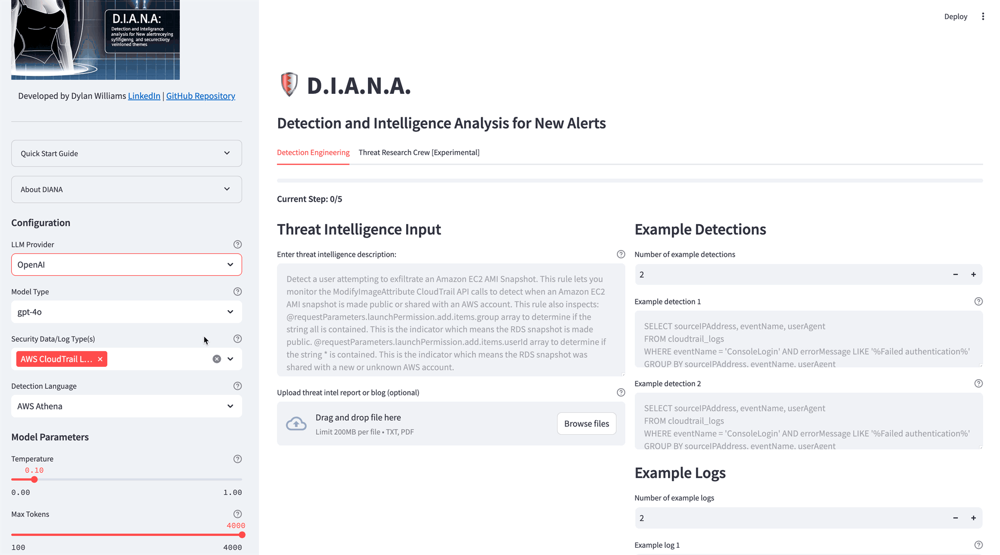

# DIANA: Detection and Intelligence Analysis for New Alerts

Diana is a Streamlit application that processes cybersecurity threat intelligence and generates high-quality detection logic, investigation steps, and response procedures using Large Language Models (LLMs).


*Select an LLM provider, security log source and detection language*


*DIANA will convert the threat description into a detection, investigation steps and perform a QA check*

## Threat Research Agents


*Spin up a crew of autonomous agents to perform threat detection research*

## Features

- Automates the creation of detections from threat intelligence
- Supports models accessed via OpenAI API, Anthropic API, and other major LLM providers
- Converts threat intelligence from natural language descriptions, documents, or website URLs into high-quality detection logic, investigation steps, and response procedures
- Allows selection of LLM provider, security log source, and detection language to customize outputs
- Performs quality assurance checks on generated detection logic to ensure syntax accuracy
- Spin up a crew of AI agents for enhanced threat research (Crew AI, EXA AI, Firecrawl)
- Requires diverse, high-quality example detections and example log sources for optimal results
- Follows user-defined detection writing steps and workflows just like a new teammate would
- Generates comprehensive alert triage and investigation steps using Palantir's ADS framework
- Runs locally on the user's machine as a Streamlit app

## Roadmap

- [ ] Multi-modal support (upload slides from your favorite cons or presentations, diagrams, images of incidents, TTPs)
- [ ] Amazon Bedrock integration (data security and privacy)
- [ ] Docker container (host Diana yourself in your environment)
- [ ] Personalized prompts (when you're happy with your results, save your custom prompts so you don't have to keep copy/pasting example detections and logs)
- [ ] Auto prompt optimization (paste your examples and instructions and your prompt will be optimized for you to get the best possible results)
- [ ] Metrics & Monitoring (view how much tokens you use and your cost $)
- [ ] RLHF (reinforcement learning from human feedback, thumbs up and down your answers to improve the quality of your results)
- [ ] Asynchronous/batch processing (convert 10 TTPs all at once in parallel)
- [ ] Customizable alerting & notification (send results to Slack, Google Chat or Jira ticket)
- [ ] Select your threat intel resource of choice (i.e. your favorite blog website or open-source detection content repo)
- [ ] Enhanced User Documentation and Tutorials: comprehensive user guides, video tutorials, and example use cases to help users get started and make the most out of Diana.
- [ ] Front End migration (TBD)
- [ ] Search & Tuning Agent (automatically search your SIEM/XDR/security data lake with your converted detection logic and correct for benign positives)


## Installation

1. Clone the repository:
   ```
   git clone https://github.com/dwillowtree/diana.git
   cd diana
   ```
2. Create a virtual environment and activate it:
   ```
   python3.10 -m venv venv
   source venv/bin/activate  # On Windows use `venv\Scripts\activate`
   ```
3. Install the required dependencies:
   ```
   pip install -r requirements.txt
   pip install 'crewai[tools]' # you will need to manually install this library
   ```
4. Set up your environment variables:
   - Copy the `.env.example` file to `.env`
   - Edit the `.env` file and add your OpenAI, Anthropic, and EXA AI API keys

## Usage

To run the Streamlit app locally:
```
streamlit run app.py
```
Then, open your web browser and go to `http://localhost:8501`.  
PRO TIP: Use Claude 3 Haiku (fast, cheap and smart)

## Configuration

1. Obtain API keys:
   - For OpenAI: Visit https://platform.openai.com/account/api-keys
   - For Anthropic: Visit https://www.anthropic.com or follow their documentation
   - For EXA AI (this is only needed for the threat research agents): Visit https://exa.ai to obtain your API key. Exa searches the web based on the meaning
   of your search, as opposed to keyword search with Google. https://exa.ai/faq
   - For Firecrawl: Visit https://www.firecrawl.dev/ you can scrape 500 pages for free a month

2. Add your API keys to the `.env` file:
   ```
   OPENAI_API_KEY=your_openai_api_key_here
   ANTHROPIC_API_KEY=your_anthropic_api_key_here
   EXA_API_KEY=your_exa_ai_api_key_here
   FIRECRAWL_API_KEY=your_firecrawl_api_key_here
   ```

## Contributing

1. Fork the repository
2. Create a new branch (`git checkout -b feature/your-feature-name`)
3. Make your changes
4. Commit your changes (`git commit -am 'Add some feature'`)
5. Push to the branch (`git push origin feature/your-feature-name`)
6. Create a new Pull Request

Please ensure that your code follows the existing style and includes appropriate tests and documentation.

## License

This project is licensed under the MIT License - see the [LICENSE](LICENSE) file for details.